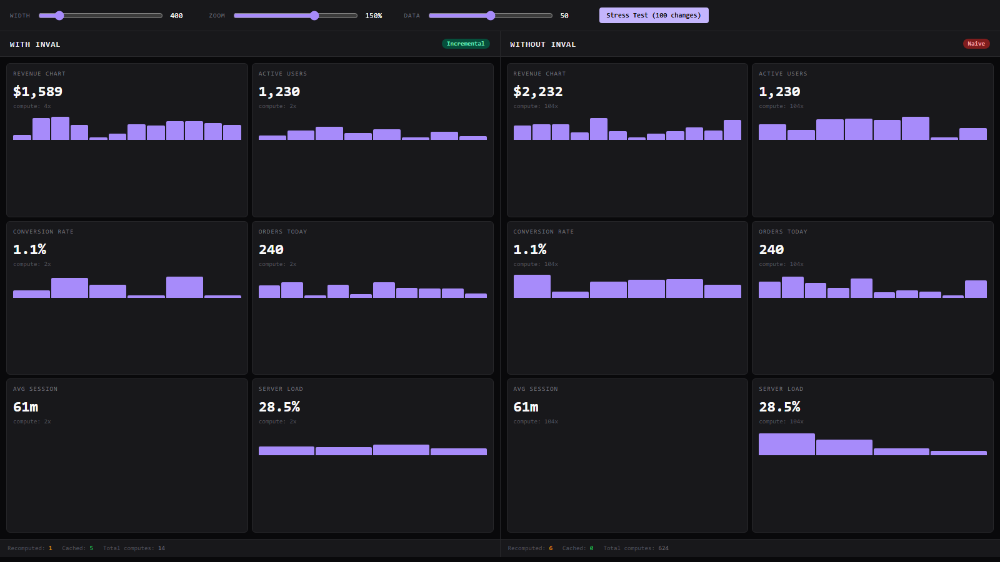

# Layout invalidation, solved. 

**Deterministic, incremental layout invalidation engine.**

```
naive:  50 widgets, change 1 width     417K ops/s
inval:  50 widgets, change 1 width   4,230K ops/s  (10x faster)
```

---

## The Problem

Every developer building interactive UIs hits this wall:

1. **Dashboards lag on resize** — Resize a sidebar, watch the entire dashboard stutter
2. **Virtualized lists jitter** — Scroll position jumps when dynamic-height rows load
3. **Responsive layouts cost too much** — Every breakpoint requires careful memoization
4. **Performance debugging is guesswork** — "Why did this re-render?" has no answers

**The root cause:** There's no abstraction for "what geometry changed, and what depends on it?"

---

## Install

```bash
npm install @blu3ph4ntom/inval
bun add @blu3ph4ntom/inval
pnpm add @blu3ph4ntom/inval
```

---

## Quick Start

```typescript
import { input, node, why } from '@blu3ph4ntom/inval'

const width = input(800)
const height = input(600)

const area = node({
  dependsOn: { w: width, h: height },
  compute: ({ w, h }) => w * h
})

area.get()        // 480000 — computes lazily
area.get()        // 480000 — cached, zero cost

width.set(1000)
area.get()        // 600000 — recomputes only what changed

why(area)         // ['area', 'width'] — trace exact invalidation path
```

---

## Why More Code?

Yes, this is more typing:

```typescript
const area = node({
  dependsOn: { w: width, h: height },
  compute: ({ w, h }) => w * h
})
```

vs:

```typescript
const area = width * height
```

**But what is your "simple" version hiding?**

```typescript
function getArea() {
  // Did width or height change since last call?
  // Do I need to recompute or can I return cached?
  // What if I forgot a dependency and it's stale?
  // How do I debug why it recomputed at 3am?
  return width * height
}
```

Inval handles all of that automatically:
- **Caching** — Returns cached value if deps haven't changed
- **Incremental updates** — Only recomputes what changed
- **Debugging** — `why(node)` traces exact invalidation path

**For trivial cases** — use plain math. **When layout complexity grows** — Inval scales.

---

## API

### `input(value)` — Leaf node. External code sets value.

```typescript
const width = input(800)
width.get()           // 800
width.set(600)        // marks dependents dirty
width.invalidate()   // force invalidation
width.isDirty()       // false (inputs are never dirty)
width.inspect()      // debug info
width.dispose()       // disconnect from graph
```

### `node({ dependsOn, compute })` — Computed node. Lazy, cached.

```typescript
const area = node({
  dependsOn: { w: width, h: height },
  compute: ({ w, h }) => w * h
})

area.get()            // 480000 — computes if dirty
area.get()            // 480000 — cached
area.isDirty()        // true after dependency change
area.invalidate()     // force recompute
area.dispose()        // cleanup
```

### `batch(fn)` — Atomic updates. Returns all changed nodes.

```typescript
const changed = batch(() => {
  a.set(10)
  b.set(20)
})
// changed = Set of all dirtied nodes
```

### `why(node)` — Debug. Trace exact invalidation path.

```typescript
why(cardHeight)
// ['cardHeight', 'textHeight', 'width']
```

### `ancestors(node)` / `descendants(node)` — Graph navigation.

```typescript
ancestors(node)   // all upstream nodes
descendants(node) // all downstream nodes
```

### `toDot(nodes)` — Export graph as DOT for visualization.

```typescript
console.log(toDot([area]))
// Paste to graphviz.online
```

### `stats(nodes)` — Monitor graph size.

```typescript
stats([root])
// { nodeCount, inputCount, computedCount, edgeCount, totalComputeCalls }
```

---

## Real-World Examples

### Variable-Height Virtualized List

```typescript
const viewportWidth = input(800)
const scrollTop = input(0)
const items = input(generateItems(1000))

const rowHeights = node({
  dependsOn: { width: viewportWidth, items },
  compute: ({ width, items }) => items.map(item => {
    const charsPerLine = Math.floor(width / 8)
    const lines = Math.ceil(item.text.length / charsPerLine)
    return lines * 20 + 16
  })
})

const totalHeight = node({
  dependsOn: { heights: rowHeights },
  compute: ({ heights }) => heights.reduce((a, b) => a + b, 0)
})

const visibleRange = node({
  dependsOn: { offsets: rowOffsets, scroll: scrollTop },
  compute: ({ offsets, scroll }) => { /* ... */ }
})

// Width change → rowHeights + totalHeight + visibleRange dirty
viewportWidth.set(400)

// Scroll change → ONLY visibleRange dirty
scrollTop.set(500)
rowHeights.isDirty()   // false
totalHeight.isDirty()  // false
```

### Dashboard with Multiple Widgets

```typescript
const dashboardWidth = input(1200)
const zoomLevel = input(1)

// Chart depends on width
const chartWidth = node({
  dependsOn: { dash: dashboardWidth },
  compute: ({ dash }) => dash * 0.6
})

// Table depends on width + zoom
const tableWidth = node({
  dependsOn: { dash: dashboardWidth },
  compute: ({ dash }) => dash * 0.4
})
const tableRowHeight = node({
  dependsOn: { zoom: zoomLevel },
  compute: ({ zoom }) => 40 * zoom
})

// Zoom change: only tableRowHeight dirty (chartWidth NOT dirty)
// Width change: chartWidth + tableWidth dirty (tableRowHeight NOT dirty)
```

---

## How It Works

1. **DAG** — Nodes form a directed acyclic graph. Cycles detected at construction.
2. **Lazy** — `node.get()` recomputes only if dirty. Returns cached otherwise.
3. **Incremental** — `input.set()` walks children, marks only affected nodes dirty.
4. **Pure** — No DOM. You measure, you pass values in.
5. **Zero deps** — Pure TypeScript. No external runtime dependencies.

---

## Features

- **Zero dependencies** — Pure TypeScript, 12KB packed
- **Framework agnostic** — React, Vue, Svelte, vanilla JS, IIFE bundle
- **71 tests** — Deterministic behavior guaranteed
- **Debug tools** — `why()`, `inspect()`, `toDot()`, `stats()`

---

## The Evidence

Real issues from popular virtualization libraries:

**TanStack Virtual** (7K stars):
- [#832](https://github.com/TanStack/virtual/issues/832): "Scrolling with dynamic height lags and stutters"
- [#659](https://github.com/TanStack/virtual/issues/659): "Scrolling up with dynamic heights stutters"

**react-window** (17K stars):
- [#741](https://github.com/bvaughn/react-window/issues/741): "VariableSizeList causes major scroll jitters"

**Root cause:** No dependency graph = must recompute ALL on any change.

Inval solves this at the engine level.

---

## Demos

```bash
git clone https://github.com/Blu3Ph4ntom/inval.git
cd inval
bun install
```

**Open in browser:**
- `demo/pure/index.html` — With Inval
- `demo/without-inval/index.html` — Without (naive)



Left panel uses Inval: cached count stays high after initial computation. Right panel recomputes everything on each change.

---

## License

MIT — free for commercial use.
